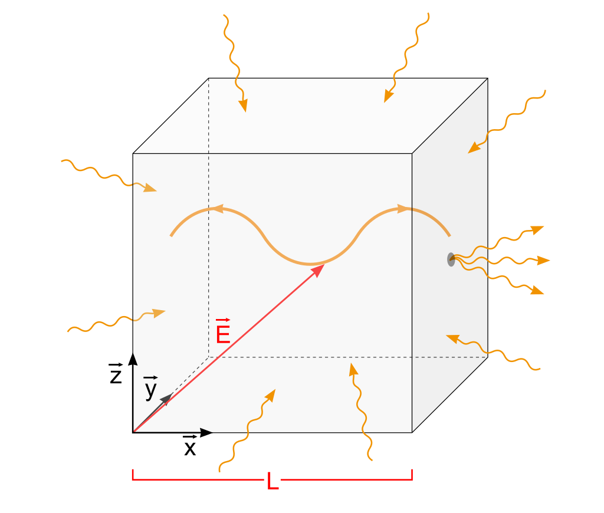

# Herleitungen zur UV-Katastrophe

Jeder Körper mit einer Temperatur $T$ strahlt in den ihn umgebenden Raum elektromagnetische Wellen ab. Er steht also ununterbrochen mit seiner Umgebung in einem Austausch von thermischer Strahlung und damit Energie. Dieses Phänomen wird auch als Wärmestrahlung bekannt und wir können es z.B. in Form von Sonnenstrahlen auf der Haut direkt erfahren. Welche Beschaffenheit hat aber diese Strahlung, welche elektromagnetischen Wellen werden emittiert? Kann etwa nur eine Wellenlänge emittiert werden, oder verschiedene Wellenlängen? Und wie würde sich dann die abgestrahlte Energie verteilen?

Präziser formuliert stellen wir uns hier die Frage:

**Welche Energiedichte liegt bei einer bestimmten Wellenlänge in der emittierten Strahlung vor?**

## Hohlraumstrahlung

Das einfachste Modell für einen Körper, der Wärmestrahlung abgibt, ist ein Hohlkörper aus dem durch ein kleines Loch die elektromagnetische Strahlung entweicht. In der folgenden Abbildung ist ein solcher würfelförmiger Hohlraum mit der Kantenlänge $L$ und dem erwähnten Loch.

Die Beschreibung als Hohlraum ist extrem praktisch, weil sich im Inneren des Hohlraums stehende elektromagnetische Wellen ausbilden, welche durch das kleine Loch nicht beeinflusst werden. Warum stehende Wellen? An den Wänden des Hohlraums muss das elektrische Feld verschwinden, wie an einem festen Seilende sind also die Randbedingungen die Ursache.

**Welche Wellen mit welchen Wellenlängen enthält der Hohlraum?**

Es muss aufgrund der Randbedingungen für einen zulässigen Wellenvektor $\vec k$ gelten:

$$k_x = n_x \frac{\pi}{L}, \quad k_y = n_y \frac{\pi}{L}, \quad k_z = n_z \frac{\pi}{L}$$